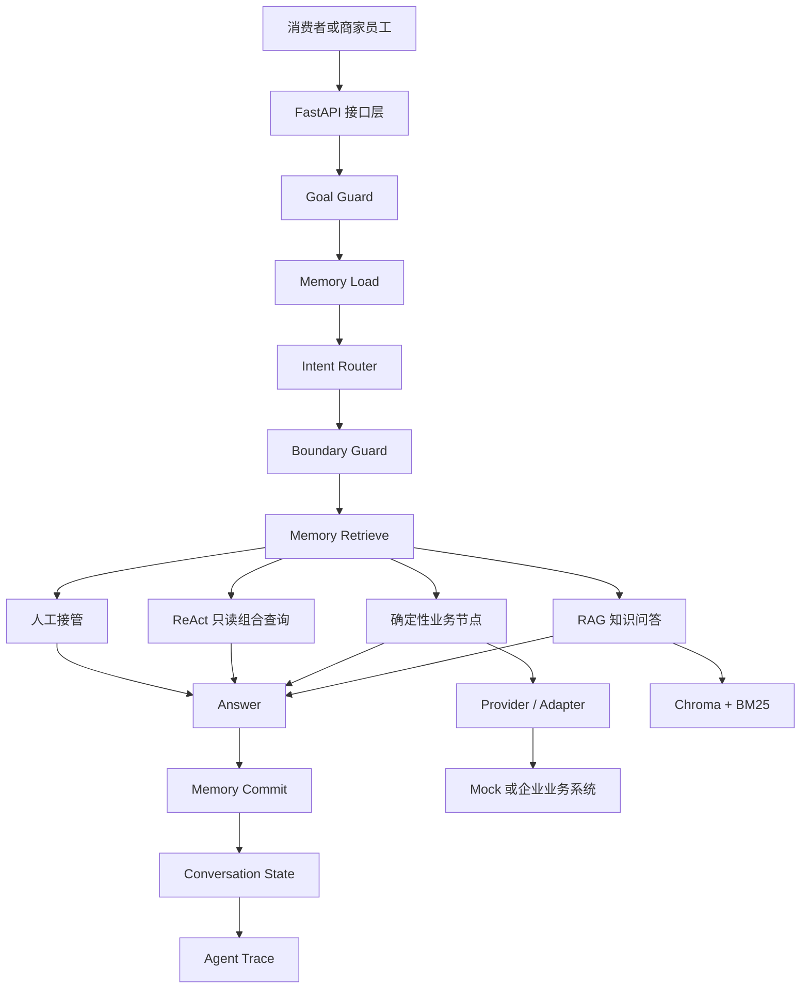

# FashionAgent

面向电商客服场景的 AI 客服自动化与辅助系统。项目使用 FastAPI、LangGraph、混合 RAG、分层记忆和服务端 RBAC，将消费者会话、商家知识与订单等业务系统连接起来，并通过安全边界、人工审核和 Agent Trace 控制自动化风险。

> 当前版本：`0.6.0`
>
> 项目性质：本地开发与作品演示，不代表生产部署、真实用户效果或真实资金处理能力。

## 项目定位

FashionAgent 不是商品、订单或售后管理平台，而是位于消费者渠道与商家业务系统之间的 AI 客服层：

- 使用 RAG 回答商品、尺码、物流和售后规则问题。
- 通过 Provider/Adapter 只读查询商品、库存和订单。
- 使用确定性服务处理退款校验、幂等和人工审批。
- 将换货、取消订单、越权请求和高风险异常转入人工队列。
- 为客服、主管、租户管理员和开发人员提供角色化运营台。
- 记录 Trace、记忆生命周期、人工操作审计和离线评测结果。

## 核心能力

| 能力 | 当前实现 |
|---|---|
| Agent 编排 | LangGraph 有状态工作流，按意图进入确定性节点、RAG、ReAct 或人工接管 |
| 意图识别 | 高精度规则、本地 BGE 语义路由、可选 LLM Planner 的分层漏斗 |
| 混合 RAG | Query Rewrite、Dense + BM25、加权 RRF、知识类型软提升、Top-K 过滤 |
| 知识生命周期 | 上传、解析、质量检查、人工审核、候选索引、激活与回滚 |
| 分层记忆 | 会话短期记忆、任务检查点、长期记忆、上下文预算、TTL 与用户治理 |
| 安全执行 | Goal Guard、Boundary Guard、工具防火墙、执行预算、重试与熔断 |
| 高风险业务 | 退款归属校验、金额阈值、幂等、人工审批和 Mock 渠道结果 |
| 多租户与 RBAC | JWT 身份、服务端权限校验、租户隔离、员工账号和操作审计 |
| 可观测与评测 | 节点级 Trace、AgentOps、RAG/意图/记忆离线评测和逐例报告 |

## 系统架构



当前工作流入口先判断目标是否越权，再加载记忆、识别意图并约束执行方式。订单、库存、尺码和退款等单一业务意图优先使用确定性节点；ReAct 仅开放低风险只读工具。`tenant_id`、`user_id` 和资源归属始终来自服务端可信身份，不由模型决定。

## 技术栈

- Python 3.12
- FastAPI + Uvicorn
- LangGraph 1.2.9
- SQLAlchemy 2.0 + SQLite
- Chroma + BGE Small Chinese Embedding
- Dense Retrieval + BM25 + Weighted RRF
- 原生 HTML、CSS、JavaScript
- Docling、python-docx、python-pptx、openpyxl 等文档处理组件

## 目录结构

```text
FashionAgent/
├─ app/
│  ├─ agent/          # LangGraph、路由、状态和业务节点
│  ├─ core/           # 配置、数据库、安全与权限
│  ├─ integrations/   # 退款渠道等外部集成边界
│  ├─ models/         # SQLAlchemy 数据模型
│  ├─ providers/      # 外部商品、库存、订单 Provider/Adapter
│  ├─ rag/            # 文档加载、切分、Embedding、检索与向量库
│  ├─ routers/        # FastAPI 接口
│  ├─ services/       # 退款、知识、记忆、审计和评测服务
│  └─ tools/          # ReAct 只读工具及安全执行器
├─ data/
│  ├─ evaluation/     # 标注集、逐例报告和离线基线
│  └─ knowledge/      # 示例原始文档与处理结果
├─ docs/              # 设计、决策、学习和评测文档
├─ frontend/          # 登录页、运营台和消费者会话 Sandbox
├─ scripts/           # 种子、迁移和评测脚本
├─ tests/             # 自动化测试
├─ .env.example
└─ requirements.txt
```

## 快速开始

以下命令以 Windows PowerShell 为例。

### 1. 获取代码并创建环境

```powershell
git clone https://github.com/yang0304119-pixel/fashion-agent.git
Set-Location fashion-agent

python -m venv .venv
.\.venv\Scripts\Activate.ps1
python -m pip install --upgrade pip
python -m pip install -r requirements.txt
```

项目当前验证环境为 Python `3.12.13`。依赖包含 PyTorch、Transformers 和文档处理组件，首次安装需要一定时间和磁盘空间。

### 2. 配置环境变量

```powershell
Copy-Item .env.example .env
```

至少需要检查并替换以下配置：

```dotenv
LLM_API_KEY=replace-me
LLM_API_BASE=https://api.example.com/v1
LLM_MODEL=replace-me

JWT_SECRET_KEY=replace-with-a-random-secret-of-at-least-32-characters

SEED_CUSTOMER_PASSWORD=replace-me
SEED_SERVICE_PASSWORD=replace-me
SEED_SUPERVISOR_PASSWORD=replace-me
SEED_ADMIN_PASSWORD=replace-me
SEED_DEVELOPER_PASSWORD=replace-me
```

- LLM 配置使用 OpenAI 兼容接口。
- 真实密钥只写入本地 `.env`，不要提交到 Git。
- 开发环境未设置 JWT 密钥时会生成本机密钥；正式环境必须显式配置强随机密钥。
- `REFUND_GATEWAY_MODE=mock` 仅用于演示，不会处理真实资金。

### 3. 准备本地 Embedding 模型

本地模型目录已被 `.gitignore` 排除，新克隆仓库需要下载 [BAAI/bge-small-zh-v1.5](https://huggingface.co/BAAI/bge-small-zh-v1.5)，并放置为：

```text
models/bge-small-zh-v1.5/
├─ config.json
├─ model.safetensors
├─ tokenizer.json
└─ ...
```

也可以使用 Hugging Face CLI：

```powershell
hf download BAAI/bge-small-zh-v1.5 --local-dir models/bge-small-zh-v1.5
```

模型缺失时，依赖语义路由、记忆语义召回或 RAG 的功能会报出明确的本地模型不存在错误。

### 4. 初始化演示数据

```powershell
python scripts\seed_data.py
```

脚本会创建默认租户、消费者、商家员工、7 款商品和演示订单。脚本幂等：数据库已有用户时会跳过种子写入。

演示员工账号：

| 用户名 | 角色 | 密码来源 |
|---|---|---|
| `service_demo` | 客服运营 | `SEED_SERVICE_PASSWORD` |
| `supervisor_demo` | 客服主管 | `SEED_SUPERVISOR_PASSWORD` |
| `admin` | 租户管理员 | `SEED_ADMIN_PASSWORD` |
| `developer_demo` | Agent 开发 | `SEED_DEVELOPER_PASSWORD` |

### 5. 启动服务

```powershell
python -m uvicorn app.main:fastapi_app --host 127.0.0.1 --port 8000 --reload
```

常用入口：

| 地址 | 用途 |
|---|---|
| <http://127.0.0.1:8000/> | 商家员工登录页 |
| <http://127.0.0.1:8000/admin.html> | 角色化运营台 |
| <http://127.0.0.1:8000/demo-chat.html> | 消费者会话 Sandbox |
| <http://127.0.0.1:8000/docs> | Swagger API 文档 |
| <http://127.0.0.1:8000/api/health> | 健康检查 |

### 6. 初始化知识库

Chroma 索引属于本地产物，不随 Git 提交。启动后使用运营台的“知识运营”完成：

```text
上传文档 → 解析与质量检查 → 人工审核 → 创建候选索引 → 激活版本
```

只有已审核并进入活跃构建的租户文档才会用于当前租户 RAG。仓库中的 `data/knowledge/raw` 和 `data/knowledge/processed` 是示例材料，不等同于已经发布的线上知识库。

## 主要业务链路

### 知识问答

```text
用户问题 → 历史感知 Query Rewrite → Dense + BM25 → RRF
→ 有效版本与租户过滤 → Top-K 文档 → LLM 基于来源回答
```

### 订单、库存与尺码

单一意图进入确定性节点，通过 Provider 查询可信业务数据，不让 LLM 编造订单归属、库存数量或价格。

### 退款

```text
退款请求 → 订单与用户归属校验 → 幂等检查 → 租户退款阈值
→ 小额 Mock 渠道处理 / 高风险人工审核 → 状态与 Trace 入库
```

退款不会注册为 ReAct 工具。模型不能决定退款金额、风险等级、订单状态或审批权限。

### 人工接管

换货、取消订单、危险目标、执行预算耗尽、工具致命错误和用户主动要求人工等场景会进入 `unresolved_case` 或退款专用 `ticket`，而不是只返回一段“已转人工”的文本。

## 角色与权限

| 角色 | 主要工作区 |
|---|---|
| `customer_service` | 今日待办、人工处理、订单、未解决案例、知识草稿 |
| `supervisor` | 客服能力、退款审核、知识审核发布、业务质检 |
| `tenant_admin` | 主管能力、员工账号、租户设置、人工操作审计 |
| `developer` | Agent Trace、AgentOps、记忆诊断、安全边界、知识测试 |

前端菜单只负责展示；真正的权限边界由后端 `require_permission()`、JWT 当前身份和租户过滤共同执行。无权接口返回 `403`。

## API 概览

| 前缀 | 功能 |
|---|---|
| `/api/auth` | 登录与当前身份 |
| `/api/chat` | Agent 会话 |
| `/api/demo-store` | 模拟消费者与商品入口 |
| `/api/orders`、`/api/refunds`、`/api/tickets` | 当前用户业务数据 |
| `/api/memories` | 用户长期记忆与会话记忆治理 |
| `/api/admin` | 运营总览、退款审核、质检、员工和租户设置 |
| `/api/admin/knowledge` | 知识文档、版本、测试、发布和回滚 |
| `/api/agentops` | Trace、RAG、工具、记忆、安全边界和健康诊断 |

完整请求模型和响应结构以启动后的 Swagger 文档为准。

## 数据库与迁移

默认数据库为 `data/fashion.db`。应用启动时会创建缺失表，并为默认 SQLite 数据库执行幂等迁移。

维护已有数据库前建议先备份。常用手动命令：

```powershell
python scripts\migrate_knowledge_lifecycle.py --database data\fashion.db
python scripts\migrate_memory_system.py --database data\fashion.db
python scripts\migrate_staff_roles.py --database data\fashion.db
python scripts\migrate_staff_roles.py --database data\fashion.db --verify-only
```

项目当前使用 `create_all()` 与手写幂等迁移，尚未引入 Alembic。

## 测试与评测

### 完整回归

```powershell
python -X utf8 -m unittest discover -s tests -q
```

最近一次本地验证为 `228/228` 项测试通过（2026-07-27）。这只能证明当前代码回归状态，不代表线上业务准确率。

### 离线评测

```powershell
python -X utf8 scripts\evaluate_rag.py
python -X utf8 scripts\evaluate_intent.py
python -X utf8 scripts\evaluate_memory.py
```

仓库内报告包括：

- `data/evaluation/rag-report.json`：RAG 逐例检索结果。
- `data/evaluation/rag-summary.md`：当前租户/构建的检索摘要。
- `data/evaluation/intent-report.json`：规则 + 本地 BGE 两层意图基线。
- `data/evaluation/memory-report.json`：记忆写入、隔离、召回和恢复案例。
- `data/evaluation/project-baseline.json`：带范围说明的项目基线快照。

当前仓库中的活跃构建 RAG 报告包含 31 个问题、51 个来源标注：Recall@3 为 `92.20%`、Hit@3 为 `100%`、MRR@5 为 `0.9462`。这些数值只评估离线检索，不包含最终答案生成、网络、远程 Query Rewrite、并发或生产流量，因此不是回答准确率、用户问题解决率或生产 SLA。

## 安全边界

- Goal Guard 在 Router 和 LLM 前阻断批量退款、权限绕过、凭证泄露、系统命令等危险目标。
- Boundary Guard 将只读、确定性退款、人工审批和禁止执行目标分流。
- Tool Firewall 默认拒绝，只向 ReAct 开放低风险只读工具。
- 工具的租户、用户和资源标识由服务端注入，模型不能覆盖。
- Agent 受最大迭代、最大工具次数、总执行时间、LLM 超时和输出 Token 预算约束。
- 业务质检视图与完整技术 Trace 分离，避免向普通运营角色暴露内部参数和诊断信息。

## 详细文档

- [项目设计文档](docs/01-项目设计文档.md)
- [退款工作流架构决策](docs/11-退款工作流架构决策.md)
- [知识库处理与审核流程](docs/12-知识库处理与审核流程.md)
- [分层意图识别漏斗](docs/13-分层意图识别漏斗.md)
- [分层记忆系统](docs/14-分层记忆系统.md)
- [Agent 安全边界](docs/15-Agent安全边界.md)
- [商家员工 RBAC 与角色化工作台](docs/16-商家员工RBAC与角色化工作台.md)
- [量化评测基线](docs/17-量化评测基线.md)

## 当前边界

- SQLite、进程内熔断和本地 Chroma 适合单机 Demo，不是高可用生产架构。
- 商品、库存和订单当前由 SQLAlchemy Mock Adapter 提供；真实接入需要实现企业平台 Adapter。
- 退款渠道为 Mock 或人工模式，不处理真实资金。
- 每个员工当前只有一个角色，尚未实现多角色关联表。
- 仓库没有真实生产流量、真实用户反馈、CSAT、线上端到端延迟或业务解决率证据。
- RAG 检索指标、自动化测试和 LLM Judge 指标不能互相替代。

## 开发建议

提交代码前至少运行：

```powershell
python -X utf8 -m unittest discover -s tests -q
git diff --check
```

新增写操作时，不要直接把工具加入 ReAct 注册表；应建立独立确定性工作流、服务端授权、幂等策略和人工审批记录。
